# Study Synopsis Studio

Study Synopsis Studio is a prototype workflow app for creating a study synopsis from structured study-design inputs, AI-assisted drafting, optional study schema visualization, optional literature planning, optional Schedule of Activities (SoA), editable section prompts, final synopsis generation, and Word/PPT-friendly export outputs.

The app is intentionally organized around researcher decisions rather than a generic long form. Users define the study concept first, then the app derives downstream artifacts only when enough source information exists.

## Quick Start

```bash
npm install
cp .env.example .env.local
# Add OPENAI_API_KEY to .env.local
npm run dev:3001
```

Open:

```text
http://localhost:3001
```

Useful scripts:

```bash
npm run dev:3001        # Next.js app on 127.0.0.1:3001
npm run build           # Production build check
npm run preview:3001    # Serve production build on 127.0.0.1:3001
npm run backend:dev     # Experimental FastAPI backend scaffold
npm run frontend:dev    # Experimental Vite frontend scaffold
```

## Architecture

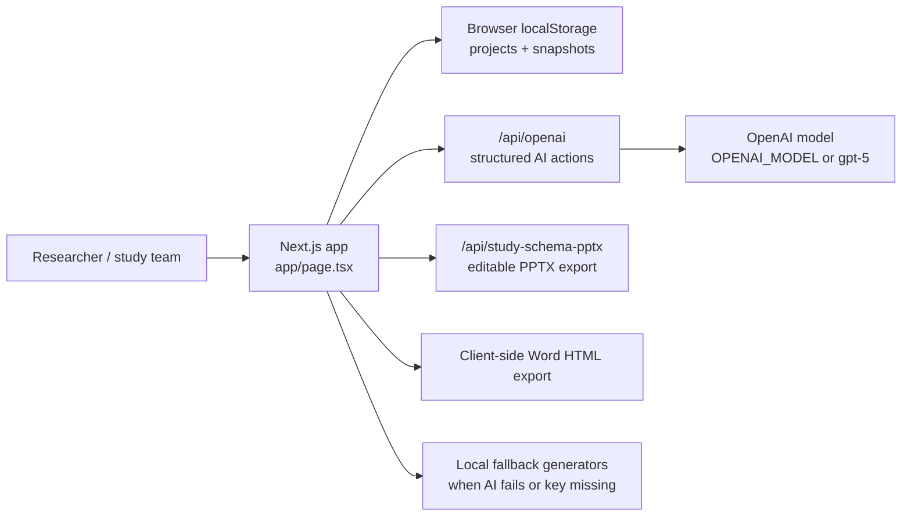

Main files:

| Path | Purpose |
| --- | --- |
| `app/page.tsx` | Main application state, UI, local generators, validation, sample-size logic, SoA logic, schema preview, export orchestration. |
| `app/api/openai/route.ts` | Server-side OpenAI integration using structured responses for import, PICO/stats, literature, objectives, endpoints, SoA, impact, and schema generation. |
| `app/api/study-schema-pptx/route.ts` | Generates editable PowerPoint study-schema slides. |
| `backend/` | Experimental FastAPI scaffold for future separation of backend logic. |
| `frontend/` | Experimental Vite/React scaffold for future frontend separation. |
| `docs/` | Generated explainer decks and scripts. |

## Product Workflow

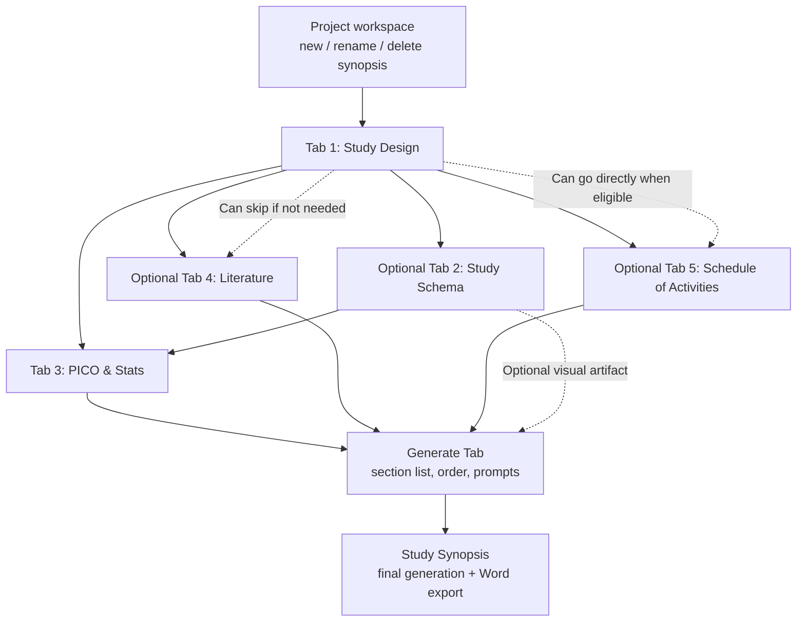

The intended researcher flow is:

1. Define the study intent and core scientific question in Tab 1.
2. Optionally generate a one-slide study schema to pressure-test whether the concept is understandable.
3. Extract PICO and statistical assumptions in Tab 3.
4. Optionally build a literature plan if background or rationale support is needed.
5. Optionally generate and edit an SoA for interventional or prospective non-interventional studies.
6. Generate synopsis sections, adjust prompts/order, then generate the final synopsis and export.

## Project Persistence

The app stores workspaces in browser localStorage:

```mermaid
classDiagram
  class WorkspaceProjectStore {
    activeProjectId
    projects[]
    snapshots{}
  }
  class WorkspaceSnapshot {
    activeTab
    workflowOptions
    study
    studySchema
    pico
    stats
    sampleSizeEstimate
    literature
    schedule
    scheduleInsights
    sections
    finalSections
    reviews
    savedAt
  }
  WorkspaceProjectStore --> WorkspaceSnapshot
```

This means projects are local to the browser unless exported or pushed to a backend in a future version.

## Tab 1: Study Design Logic

Tab 1 is the source of truth for most downstream generation. The app expects the user to first answer:

```text
What is this study mainly trying to achieve?
```

That combined answer is represented internally as `primaryStudyAim`, then mapped into program intent and evidence-destination logic behind the scenes.

### Main Study Design Fields

| Field | What it means | Downstream use |
| --- | --- | --- |
| Study title | Working synopsis/project title | Section headings, schema title, exports. |
| Research category | Interventional, non-interventional, evidence synthesis, non-clinical | Determines visible subtype options, SoA eligibility, schema pattern, validation rules. |
| Study subtype | RCT, adaptive, primary data collection, secondary database, systematic review, etc. | Drives design-specific language, schema pattern, schedule eligibility, sample-size warnings. |
| Development stage | Phase or non-phase status | Enables objective drafting and protocol guardrail logic. |
| Primary study aim | Combined program/evidence intent | Drives AI objective style, endpoint discipline, guardrails, impact assessment. |
| PED/protocol guardrail profile | Auto or explicit lean protocol-drafting guardrails | Constrains AI toward focused objectives, limited endpoints, streamlined data collection. |
| Therapeutic area | Broad disease domain | Narrows disease selector and endpoint suggestions. |
| Disease / indication | Specific disease context | Drives endpoint suggestions, population drafting, schema labels, PICO population. |
| Intervention / drug | Product, exposure, regimen, or index treatment | Drives objectives, endpoints, schema arms, SoA rows. |
| Intervention class | Mechanism/class context | Helps AI infer relevant endpoints and safety/monitoring considerations. |
| Comparator | Control, benchmark, SOC, or external comparator | Critical for objective wording, PICO comparator, schema comparator arm, sample-size interpretation. |
| Line of therapy / setting | Treatment setting or evidence context | Refines population, comparator, eligibility, endpoints. |
| Primary objective | What the study will test | Drives PICO, endpoints, stats, schema, final synopsis. |
| Secondary objectives | Focused supporting objectives | Drives endpoints, PICO outcomes, synopsis sections. |
| Design overview | Core design framing | Drives schema, SoA, sample-size warnings, synopsis design section. |
| Population | Target participants/evidence source | Drives eligibility, PICO, schema, impact assessment. |
| Eligibility highlights | Inclusion/exclusion summary | Drives SoA screening rows, synopsis eligibility, schema if selected. |
| Endpoints and assessments | Focused endpoint package | Drives PICO outcomes, sample-size assumptions, SoA activities, impact assessment. |
| Timeline | Enrollment/follow-up duration | Drives schema timeline arrows, SoA visit cadence, synopsis operations. |
| Geography | Region/country context | Drives feasibility, literature plan, impact assessment, schema summary. |
| Sample size planning input | User-entered planned sample size | Compared against Tab 3 estimate and used in final generation when present. |
| Operational notes | Execution constraints | Drives SoA, feasibility language, synopsis operations. |

### Field Dependency Schema

```mermaid
flowchart TD
  Category["Research category"] --> Subtype["Study subtype"]
  Category --> ScheduleEligibility["SoA eligibility"]
  Category --> SchemaPattern["Default schema pattern"]

  Aim["Primary study aim"] --> Guardrails["PED / protocol guardrails"]
  Aim --> ObjectiveAI["AI objective suggestions"]
  Aim --> ImpactAI["AI evidence impact assessment"]

  TA["Therapeutic area"] --> Disease["Disease / indication"]
  Disease --> EndpointSeeds["Endpoint context"]
  Disease --> PopulationAI["AI population suggestion"]

  Intervention["Intervention / drug"] --> ObjectiveAI
  Comparator["Comparator"] --> ObjectiveAI
  Comparator --> SchemaComparator["Schema comparator box"]

  Objective["Primary + secondary objectives"] --> EndpointAI["AI endpoint suggestions"]
  Objective --> PopulationAI
  Objective --> Pico["PICO extraction"]

  Population["Population"] --> EligibilityAI["AI eligibility suggestion"]
  Population --> ImpactAI

  Endpoints["Endpoints"] --> Stats["Stats assumptions"]
  Endpoints --> SampleSize["Sample-size estimate"]
  Endpoints --> SoA["Schedule activities"]
  Endpoints --> ImpactAI
```

### AI Suggestions in Tab 1

AI buttons are field-level. A button should be active only when the minimum required context exists; otherwise the helper text says what is missing.

| AI action | Minimum inputs | What AI proposes | User control |
| --- | --- | --- | --- |
| Import and prefill | PDF, Word, or PowerPoint file | Study-design fields, assumptions, gaps, replaced fields | User reviews import report; source can replace conflicting prefilled values. |
| Suggest objectives | Development stage plus enough study framing: aim, disease, intervention, comparator or design context | Primary objective, secondary objectives, design overview, alternative packages | Modal lets user select only desired pieces; change request can regenerate alternatives. |
| Suggest population | Objective plus disease/intervention/study type context | First-pass target population | User can accept/edit as text. |
| Suggest eligibility | Completed population field | Inclusion/exclusion highlights | Structured list allows individual delete/disable/edit. |
| Suggest endpoints | Objective plus disease/intervention/study type context | Focused endpoint package, not a laundry list | Structured endpoint items allow individual delete/disable/edit. |
| Assess study impact | Essential concept fields: objective, comparator or disease context, endpoints, population when available | Likely evidence impact: publication, practice, HTA, guideline, label relevance | Displayed in a modal so Tab 1 stays uncluttered. |

### Structured Items vs Raw Text

Some fields support both a concise raw-text editor and structured items:

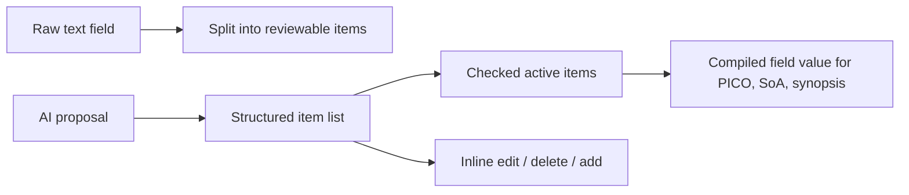

Structured item lists are used where long paragraphs become hard to control:

- Secondary objectives
- Eligibility highlights
- Endpoints and assessments
- Operational notes

The product principle is: AI may draft, but users decide what stays active.

## Program Intent and PED Guardrails

The app separates two concepts while trying not to expose too much terminology to users:

| Concept | User-facing idea | How it affects AI |
| --- | --- | --- |
| Primary study aim | What is this study mainly trying to achieve? | Sets the strategic direction. |
| Evidence use intent | What downstream decision will the evidence support? | Guides rigor expectations, comparator strength, endpoint discipline. |
| PED/protocol guardrails | Lean practice-informing protocol requirements | Constrains objectives, endpoints, duration, data collection burden, and SoA intensity. |

Guardrails can be auto-selected from study type and primary aim, or explicitly selected. When a PED-like profile applies, AI is instructed to prefer:

- A limited number of objectives.
- Focused endpoints tied to the research question.
- Avoiding exploratory endpoint bloat unless justified.
- Fit-for-purpose duration and data collection.
- Explicit PRO, PK/PD, biomarker, imaging, and safety items only when they support the objective or decision use.
- A Schedule of Activities that is operationally manageable.

## Study Document Import

The import workflow uses AI to extract study description content from uploaded files and prepopulate Tab 1.

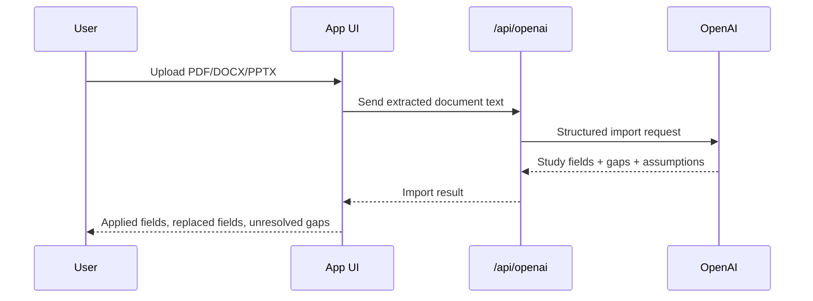

Important behavior:

- If the uploaded source clearly conflicts with existing core fields, the source can replace those fields.
- The import report lists replaced fields so the user can review contradictions.
- Missing required details are shown as unresolved gaps rather than silently guessed.

## Tab 2: Study Schema Generation

The Study Schema tab is optional. It creates a one-slide, high-level visual schema for protocol overviews, internal review, or executive presentation.

### Inputs

| Input | Options | Effect |
| --- | --- | --- |
| Detail level | Simple, standard, detailed | Controls amount of text and number of content blocks. |
| Use case | Executive slide, protocol overview, internal review | Applies content-block presets. |
| Design pattern | Auto, parallel-group, single-arm, cohort/RWE, platform, adaptive, cross-over, substudy-enabled, evidence synthesis, non-clinical | Controls node/lane logic and labels. |
| Content blocks | Objectives, endpoints, population, eligibility, timeline, comparator, decision use, design | Controls what appears in lower summary cards and schema text. |
| Regeneration instruction | Free-text change request | Steers AI or local regeneration. |
| Theme colors | J&J red/white/gray palette by default | Controls preview and export colors. |

### Schema Pattern Logic

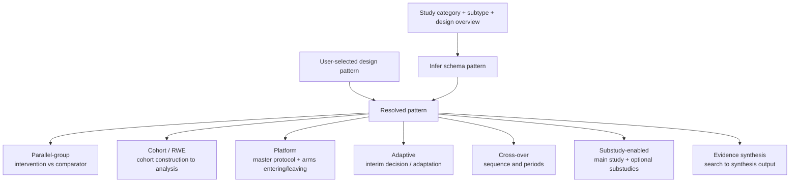

### Export

The schema can be exported as:

- SVG
- PNG
- Editable PPTX

The PPTX export uses native PowerPoint objects for boxes, arrows, text, and colors. This keeps the schema editable in PowerPoint/Keynote rather than exporting it as one flat image.

## Tab 3: PICO & Statistics

PICO and statistics can be generated from Tab 1. PICO translates study-design language into structured evidence language; statistics creates first-pass assumptions for sample-size planning and synopsis drafting.

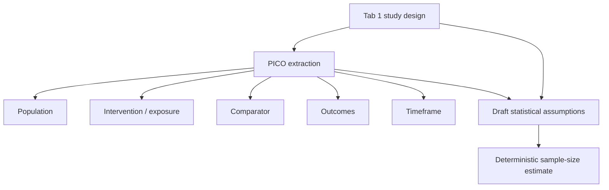

### PICO Fields

| PICO field | Primary source |
| --- | --- |
| Population | Tab 1 population + eligibility + disease. |
| Intervention / exposure | Tab 1 intervention/drug + intervention description. |
| Comparator | Tab 1 comparator. |
| Outcomes | Tab 1 endpoints and assessments. |
| Timeframe | Tab 1 timeline and endpoint timing. |

### Statistical Assumption Fields

| Stats field | Purpose |
| --- | --- |
| Estimand | Treatment-policy, hypothetical, composite, while-on-treatment, etc. |
| Endpoint type | Binary, continuous, time-to-event, mixed/composite. |
| Hypothesis | Superiority, non-inferiority, equivalence, descriptive, etc. |
| Alpha | Type I error assumption. |
| Power | Power target. |
| Effect size | Expected absolute difference, HR, standardized effect, or similar. |
| Variability/event assumptions | Baseline rate, event proportion, SD, or other variability. |
| Attrition | Non-evaluable/dropout inflation. |
| Analysis model | Logistic regression, Cox model, MMRM, CMH, etc. |
| Missing data | Imputation or handling approach. |
| Rationale | Why assumptions are reasonable and what must be checked. |

## Sample-Size Calculation

The app does not let the LLM perform the numeric calculation. AI can draft or extract assumptions, but deterministic TypeScript code calculates the estimate.

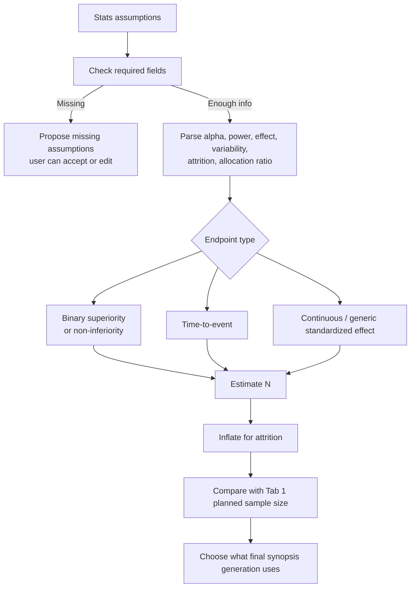

### Required Inputs

At minimum, the estimator needs:

- Endpoint type.
- Alpha.
- Power.
- Effect size.
- Attrition/non-evaluable rate.

Additional requirements depend on endpoint type:

| Endpoint type | Additional required assumptions |
| --- | --- |
| Binary | Absolute effect difference and baseline event/response rate. |
| Binary non-inferiority | Absolute effect difference, baseline rate, and non-inferiority margin. |
| Time-to-event | Hazard ratio and expected event proportion. |
| Continuous/generic | Numeric standardized effect size. |

### Calculation Methods

| Method | Formula summary | Reliability |
| --- | --- | --- |
| Binary superiority | Two-proportion approximation using alpha, power, treatment rate, comparator rate, and allocation ratio. | Deterministic planning estimate. |
| Binary non-inferiority | Risk-difference approximation using expected difference plus NI margin. | Requires biostatistics confirmation for margin direction and assay sensitivity. |
| Time-to-event | Event-driven approximation: required events from HR, then total N from expected event proportion. | Planning estimate; event assumptions require review. |
| Continuous/generic | Standardized-effect approximation using alpha, power, effect size, and allocation ratio. | Directional when endpoint type is mixed/composite. |

### Reliability Warnings

The app flags sample-size estimates as requiring biostatistics review when the design mentions:

- Adaptive or group-sequential design.
- Bayesian design.
- Cluster or site randomization.
- Recurrent-event or rate endpoint.
- Cross-over design.
- Co-primary or multiplicity-heavy strategy.

These are not blocked, but the result is labeled as planning support, not calculator-of-record output.

### Planned vs Calculated Sample Size

The app handles three common cases:

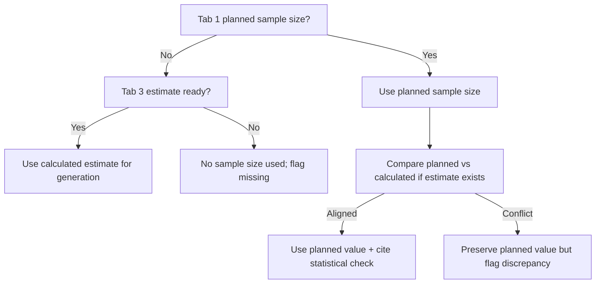

Final synopsis generation uses:

- Tab 1 planned sample size if provided.
- Tab 3 calculated estimate if Tab 1 is empty and estimate is ready.
- Tab 1 planned value plus a discrepancy flag if planned and calculated values differ materially.

## Optional Literature Tab

Literature planning is optional. It is used when the synopsis needs background/rationale support or evidence context.

AI can generate:

- Research question.
- Databases.
- Evidence window.
- Inclusion/exclusion criteria.
- Keywords.
- PubMed/Embase-style queries.
- Grey literature plan.
- Background themes.
- Follow-up prompt for deeper synthesis.

If skipped, literature does not block section generation.

## Schedule of Activities

The SoA tab is optional and appears for eligible prospective study types:

- Interventional studies.
- Prospective non-interventional studies where planned visits, contacts, assessments, or follow-up timing need to be explicit.

Evidence synthesis, secondary database-only studies, non-clinical studies, and other non-prospective designs typically skip SoA.

### SoA Data Model

The SoA is not stored as a merged-cell table. It uses a structured model:

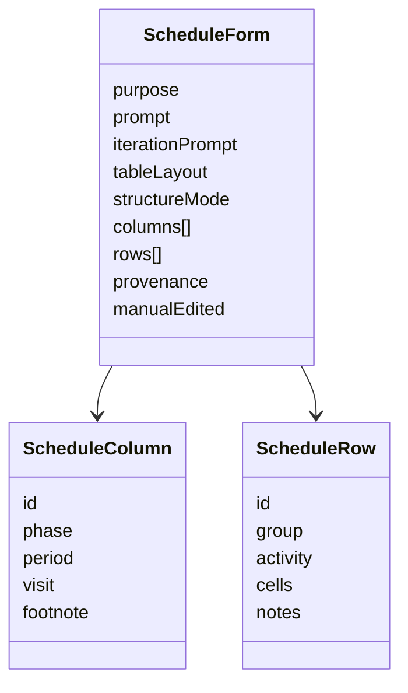

This maps to a three-level header:

```text
Study phase -> Period within phase -> Visit day/contact
```

Rows are grouped by activity section:

```text
Screening / administrative
Treatment administration
Efficacy assessments
Safety assessments
Clinical laboratory tests
PRO / biomarkers / PK-PD when relevant
Ongoing participant review
Disposition / follow-up
```

### SoA Generation Inputs

AI and local fallback SoA generation use:

- Study category and subtype.
- Intervention/drug and comparator.
- Design overview.
- Population and eligibility.
- Endpoints and assessments.
- Timeline.
- Geography and operational notes.
- PICO and stats if already generated.
- Literature context if enabled and generated.
- User-selected SoA structure mode.
- User regeneration instruction.

### SoA Structure Modes

| Mode | When to use |
| --- | --- |
| Auto | Let AI choose the simplest readable structure. |
| One common SoA | Arms/cohorts share the same visits and assessments. |
| Common SoA + conditional rows | Most visits are shared, but some rows apply only to selected arms, cohorts, regions, or substudies. |
| Separate by arm/cohort | Arms or cohorts have meaningfully different visit schedules, dosing cadence, or assessment timing. |
| Dosing table + common assessments | Treatment administration differs but efficacy/safety/follow-up are mostly shared. |

### SoA Rendering and Editing

The table supports:

- Direct cell editing.
- Add/remove activity rows.
- Add/remove visit columns.
- Editable phase/period/visit header fields.
- Frozen section and activity columns.
- Automatic or manual split into two tables for readability.
- Complexity assessment and trade-off analysis as separate modal workflows.

### SoA Complexity and Trade-Off Analysis

There are two separate analysis buttons:

| Button | Output |
| --- | --- |
| Assess complexity | Visit burden, assessment burden, operational burden, main complexity drivers, mitigations. |
| Check trade-off analysis | Candidate assessments/visits to reduce, expected benefit, data-quality risk, endpoint-protection rationale, safeguards. |

These are intentionally displayed in modals rather than below the table to reduce cognitive load.

## Generate Tab

The Generate tab creates a predefined list of synopsis sections. Users can:

- Include/exclude sections.
- Reorder sections.
- Edit each section prompt.
- Add or remove sections.
- Generate section bodies from all previous tabs.

Section generation uses current source fingerprints. If upstream data changes after a section is generated, the app can mark downstream content as stale and prompt refresh/review.

Inputs used for section generation:

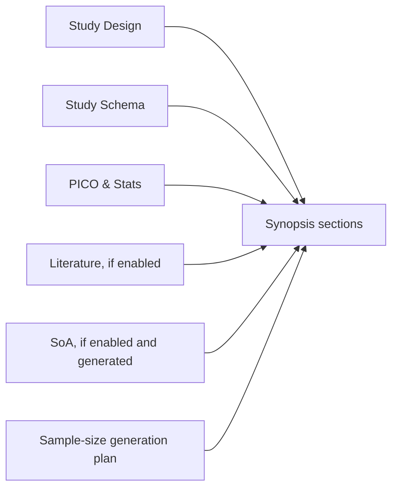

## Final Synopsis and Word Export

The final tab assembles generated/edited sections into a study synopsis. The Word export is generated from HTML content and includes the SoA when enabled and available.

Final generation uses the same sample-size generation plan described above, so sample-size conflicts are preserved as review flags rather than silently overwritten.

## AI Integration

Server-side AI calls go through:

```text
POST /api/openai
```

The API route uses structured outputs and Zod schemas where possible. If the OpenAI call fails, the app falls back to a local draft and shows a warning so the user knows the content is directional.

AI action types include:

- Study-document import.
- Objective suggestion.
- Population/eligibility suggestion.
- Endpoint suggestion.
- Evidence impact assessment.
- PICO and statistics extraction.
- Literature planning.
- SoA generation.
- SoA complexity/trade-off analysis.
- Study schema generation.
- Synopsis section/final drafting.

Important principle:

```text
AI drafts and critiques. The user selects, edits, and approves.
```

## Source Freshness and Downstream Dependencies

The app uses source fingerprints to detect when generated downstream artifacts may be stale.

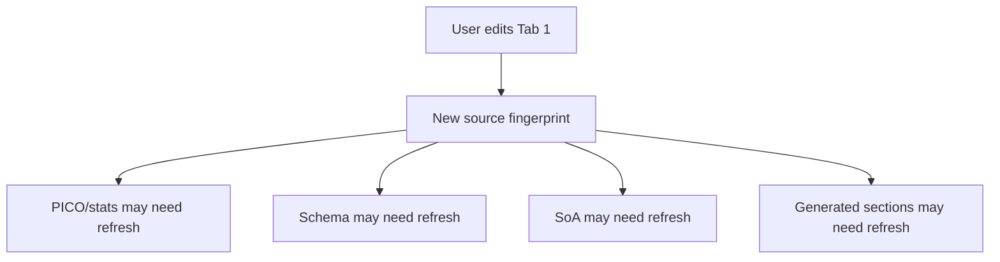

This is important because accepting an AI suggestion in one field should not silently erase previously accepted content in another field. Downstream artifacts should be refreshed intentionally, not overwritten automatically.

## Design Principles

The app follows these product rules:

- Ask for the minimum viable study concept first.
- Make AI help field-specific rather than placing one large AI block above the form.
- Show missing prerequisites before enabling an AI action.
- Let users accept only selected AI-proposed items.
- Prefer focused endpoints over long endpoint lists.
- Keep literature, study schema, and SoA optional where scientifically appropriate.
- Use deterministic code for calculations and AI for drafting/interpretation.
- Surface uncertainty and required human review.

## Limitations

This is a prototype and should not be treated as a validated protocol-generation or biostatistics system.

Known limitations:

- Sample-size calculations are planning approximations, not a validated statistical calculator.
- Complex adaptive, Bayesian, cluster, recurrent-event, cross-over, and multiplicity-heavy designs require specialist review.
- AI-generated content can be incomplete or overconfident and must be reviewed.
- LocalStorage persistence is browser-local and not multi-user.
- The FastAPI/Vite split exists as a scaffold, but the production app is still primarily Next.js.

## Deployment

The app has been deployed to Railway and can also be deployed to Netlify. Required production environment variable:

```text
OPENAI_API_KEY
```

Optional model override:

```text
OPENAI_MODEL=gpt-5
```
